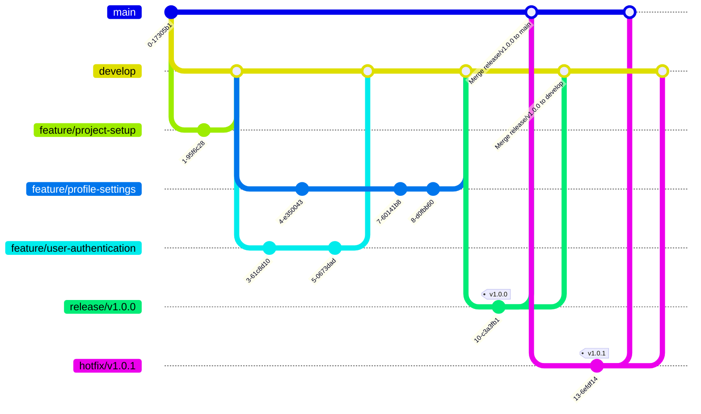

# git flow

Git flow — помогает структурировать процесс разработки и упрощает управление разными стадиями разработки и релизами.
---

## Вветки git flow
1. **`main`**:
   - Хранит стабильную версию кода, которая всегда готова для релиза.
   - После завершения релиза все изменения сливаются сюда.

2. **`develop`**:
   - Основная ветка для разработки.
   - Содержит актуальную версию кода с последними изменениями и новыми функциями, которые могут быть нестабильными.
   - Все фичи и исправления вливаются сюда.

3. **`feature`-ветки** (фичи):
   - Используются для разработки новой функциональности.
   - Ответвляются от `develop`.
   - После завершения разработки создается `pull-request` перед слиянием в `develop`.
   - Название веток: `feature/имя-фичи`.

4. **`release`-ветки** (релизы):
   - Используются для подготовки нового релиза.
   - Ответвляются от develop перед релизом.
   - Сюда можно вносить только исправления багов или минимальные правки.
   - После завершения добавляется тег релиза и код сливается в main и develop.
   - Название веток: release/номер-релиза.

5. **`hotfix`-ветки** (хотфиксы):
   - Используются для исправления критических ошибок в стабильной версии (в main).
   - Ответвляются от main.
   - После исправления сливаются в main и develop.
   - Название веток: hotfix/номер-патча.

**Пример `git flow`**

Ссылки:

- [Рабочий процесс Gitflow Workflow](https://www.atlassian.com/ru/git/tutorials/comparing-workflows/gitflow-workflow#:~:text=Git-flow%20—%20это%20устаревшая%20версия,стратегией%20управления%20ветками%20в%20Git.)
