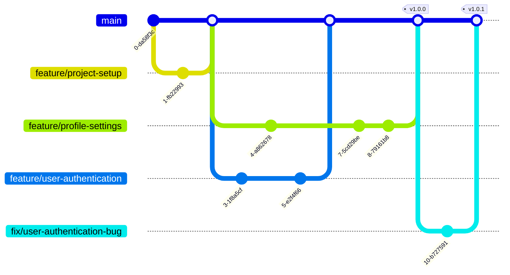

# github flow

GitHub Flow — подходит для непрерывной интеграции и деплоя (Continuous Integration/Continuous Deployment, CI/CD). Основные принципы:
  - Фичи создаются от ветки `main`.
  - Все изменения, выполняются в отдельных ветках, которые создаются из ветки main.
  - После завершения работы над фичей, открывается Pull Request (PR) для слияния изменений в ветку main.
  - Маркировка релизов может быть проведена в любой момент.
---

## Вветки github flow
1. **`main`**:
   - Хранит стабильную версию кода, которая всегда готова для деплоя в продакшн.
   - Любые изменения, попадающие в эту ветку должны быть протестированы и проверены.

2. **`feature`-ветки** (фичи):
   - Используются для разработки новой функциональности.
   - Ответвляются от `main`.
   - После завершения разработки создается `pull-request` перед слиянием в `main`.
   - Изменения из Pull Request должны пройти код-ревью и автоматические тесты (если настроены CI-инструменты).
   - Если все проверки пройдены, можно выполнять слияние Pull Request. После этого изменения попадают в ветку main.
   - Название веток: `feature/имя-фичи`.

5. **`fix`-ветки** (фиксы):
   - Используются для исправления ошибок.
   - Ответвляются от main.
   - После исправления создается `pull-request` перед слиянием в `main`.
   - Изменения из Pull Request должны пройти код-ревью и автоматические тесты (если настроены CI-инструменты).
   - Если все проверки пройдены, можно выполнять слияние Pull Request. После этого изменения попадают в ветку main.
   - Название веток: `fix/описание-исправление`.

**Пример `github flow`**

Ссылки:

- [Рабочий процесс Gitflow Workflow](https://www.atlassian.com/ru/git/tutorials/comparing-workflows/gitflow-workflow#:~:text=Git-flow%20—%20это%20устаревшая%20версия,стратегией%20управления%20ветками%20в%20Git.)
