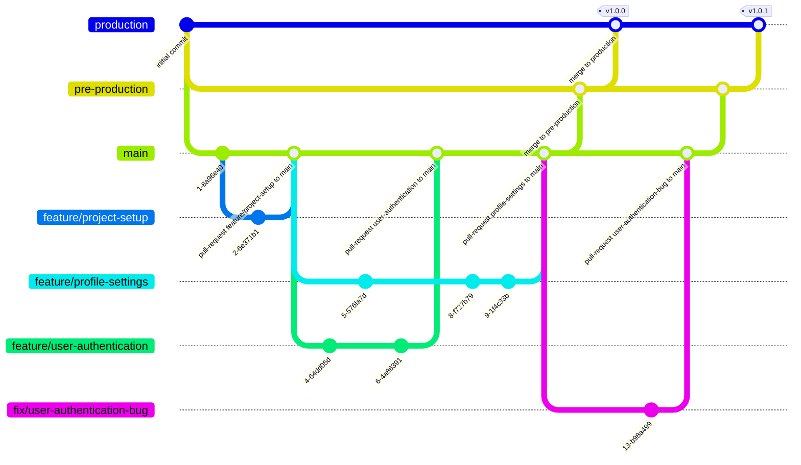
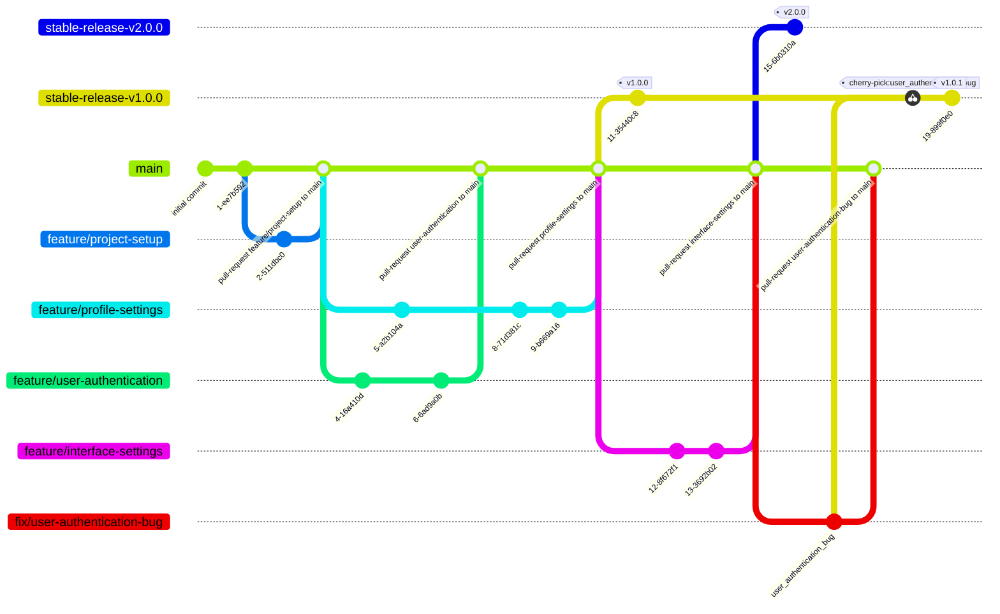

# gitlab flow

Gitlab Flow — подходит для непрерывной интеграции и деплоя (Continuous Integration/Continuous Deployment, CI/CD). Основные принципы:
  - существует два варианта стратегии ветвления gitlab flow:
    - gitlab flow с ветками окружения (gtilab flow with environment branches):
      - используются `main` ветка для хранения production-ready кода и ветки-окружения для выпуска релизов
      - коммиты проходят через ветки в строго определенном порядке для гарантии тестирования во всех средах
    - gitlab flow с релизными ветками (gtilab flow with release branches):
      - используются `main` ветка для хранения production-ready кода и релизные ветки для выпуска релизов
      - ветка очередного релиза создается от `main`
---

## gitlab flow с ветками окружения:
1. **`production`** (ветка окружения):
   - Используется для выпуска релиза и доставки клиенту (CI/CD).

2. **`pre-production`**(опция):
   - Промежуточная ветка, может использоваться для финальных проверок.

3. **`staging`**(опция):
   - Промежуточная ветка, может использоваться для начальных проверок.

4. **`main`**:
   - Хранит стабильную версию кода, которая всегда готова для деплоя в продакшн.
   - Любые изменения, попадающие в эту ветку должны быть протестированы и проверены.

5. **`feature`-ветки** (фичи):
   - Используются для разработки новой функциональности.
   - Ответвляются от `main`.
   - После завершения разработки создается `pull-request` в `main`.
   - Изменения из Pull Request должны пройти код-ревью и автоматические тесты новой функциональнсоти.
   - Если все проверки пройдены, можно выполнять слияние Pull Request. После этого изменения попадают в ветку main.
   - Название веток: `feature/имя-фичи`.

6. **`fix`-ветки** (фиксы):
   - Используются для исправления ошибок.
   - Ответвляются от main.
   - После исправления создается `pull-request` перед слиянием в `main`.
   - Изменения из Pull Request должны пройти код-ревью и автоматические тесты (если настроены CI-инструменты).
   - Если все проверки пройдены, можно выполнять слияние Pull Request. После этого изменения попадают в ветку main.
   - Название веток: `fix/описание-исправление`.

**Пример `gitlab flow` с ветками окружения**

## gitlab flow с релизными ветками:
1. **`main`**:
   - Хранит стабильную версию кода, которая всегда готова для деплоя в продакшн.
   - Любые изменения, попадающие в эту ветку должны быть протестированы и проверены.

1. **`release`-ветка**:
   - Хранит версию кода определенного релиза.
   - При необходимости выпуска релиза от `main` создается отдельная ветка для каждой мажорной версии
   - При необходимости внесения исправлений коммит с исправлением копируется в необходимую релизную ветку
   - Название веток: `release-v1.0.0` или например `stable-release-v1.0.0`.

3. **`feature`-ветки** (фичи):
   - Используются для разработки новой функциональности.
   - Ответвляются от `main`.
   - После завершения разработки создается `pull-request` в `main`.
   - Изменения из Pull Request должны пройти код-ревью и автоматические тесты новой функциональнсоти.
   - Если все проверки пройдены, можно выполнять слияние Pull Request. После этого изменения попадают в ветку main.
   - Название веток: `feature/имя-фичи`.

4. **`fix`-ветки** (фиксы):
   - Используются для исправления ошибок.
   - Ответвляются от main.
   - После исправления создается `pull-request` перед слиянием в `main`.
   - Изменения из Pull Request должны пройти код-ревью и автоматические тесты (если настроены CI-инструменты).
   - Если все проверки пройдены, можно выполнять слияние Pull Request. После этого изменения попадают в ветку main.
   - Название веток: `fix/описание-исправление`.
  
**Пример `gitlab flow` с с релизными ветками**

Ссылки:

- [Github flow tutorial]([https://www.youtube.com/watch?v=ZJuUz5jWb44](https://youtu.be/ZJuUz5jWb44?feature=shared))
- [Сравнение процесов](https://yapro.ru/article/6172)
