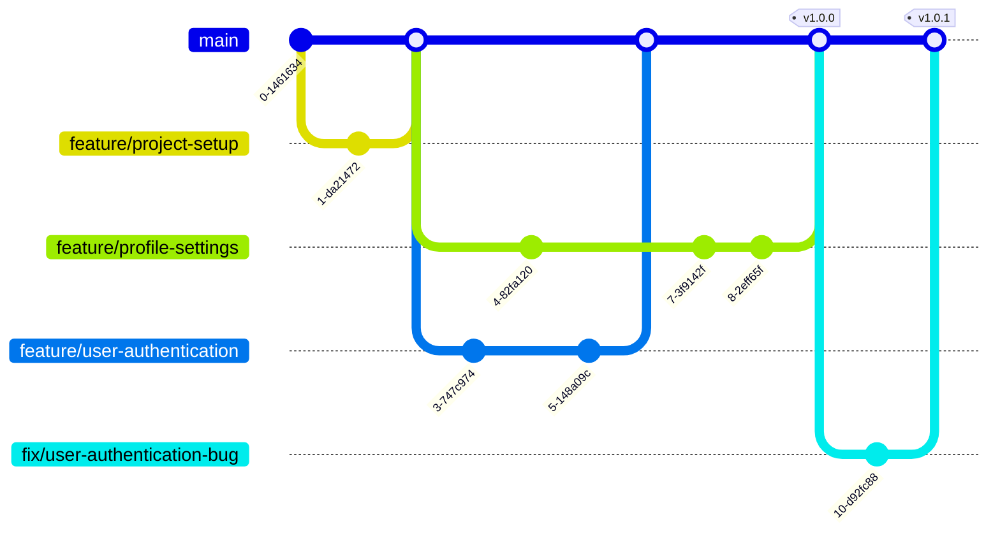

# gitlab flow

Gitlab Flow — подходит для непрерывной интеграции и деплоя (Continuous Integration/Continuous Deployment, CI/CD). Основные принципы:
  - используются произвольные ветки-окружения для эффективного контроля и проверки релизов в разных средах
  - коммиты проходят через ветки в строго определенном порядке для гарантии тестирования во всех средах
---

## Вветки gitlab flow
1. **`main`**:
   - Хранит стабильную версию кода, которая всегда готова для деплоя в продакшн.
   - Любые изменения, попадающие в эту ветку должны быть протестированы и проверены.

3. **`staging`**(опция):
   - Может использоваться для начальных проверок перед переходом в `pre-production`. Настраивается автоматический мерж из `main` в `staging`. В `staging` к примеру может производиться ряд автоматических проверок, если проверки прошли успшно происходит автоматический мерж в `pre-production`.

3. **`pre-production`**(опция):
   - Может использоваться для финальных проверок перед переходом в `production`. Настраивается автоматический мерж из `staging` в `pre-production`.
  
2. **`production`**:
   - Используется как источник релиза для автоматического развертывания. Для выпуска релиза производится мерж из `pre-production` в `production`.

2. **`feature`-ветки** (фичи):
   - Используются для разработки новой функциональности.
   - Ответвляются от `main`.
   - После завершения разработки создается `pull-request` перед слиянием в `main`.
   - Изменения из Pull Request должны пройти код-ревью и автоматические тесты (если настроены CI-инструменты).
   - Если все проверки пройдены, можно выполнять слияние Pull Request. После этого изменения попадают в ветку main.
   - Название веток: `feature/имя-фичи`.

5. **`fix`-ветки** (фиксы):
   - Используются для исправления ошибок.
   - Ответвляются от main.
   - После исправления создается `pull-request` перед слиянием в `main`.
   - Изменения из Pull Request должны пройти код-ревью и автоматические тесты (если настроены CI-инструменты).
   - Если все проверки пройдены, можно выполнять слияние Pull Request. После этого изменения попадают в ветку main.
   - Название веток: `fix/описание-исправление`.

**Пример `github flow`**

Ссылки:

- [Рабочий процесс Github flow](https://docs.github.com/en/get-started/using-github/github-flow#following-github-flow)
- [Сравнение процесов](https://yapro.ru/article/6172)
